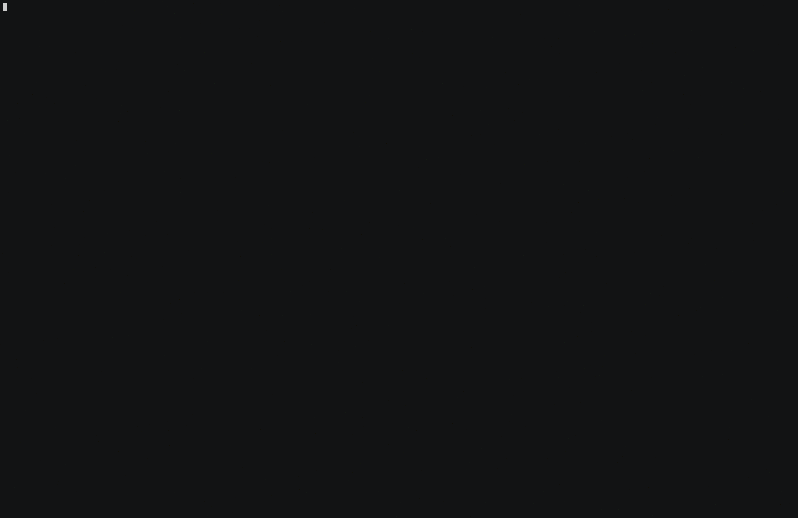

[](https://goreportcard.com/report/github.com/feliixx/mgodatagen)
[](https://codecov.io/gh/feliixx/mgodatagen)
[](https://pkg.go.dev/github.com/feliixx/mgodatagen/datagen)

# mgodatagen

A small CLI tool to quickly generate millions of pseudo-random BSON documents and insert them into a MongoDB instance. Quickly test new data structure or how your application responds when your database grows!

Try it online: [**mongoplayground.net**](https://mongoplayground.net/)

## Features

- Support all bson types listed in [MongoDB bson types](https://docs.mongodb.com/manual/reference/bson-types/)
- Generate _real_ data using [gofakeit](https://github.com/brianvoe/gofakeit)
- Create referenced fields accross collections
- Aggregate data across collections
- Create sharded collection
- Create collections in multiple databases
- Cross-plateform



## installation

Download the binary from the [release page](https://github.com/feliixx/mgodatagen/releases)

or

Build from source:

First, make sure that go is installed on your machine (see [install go](https://golang.org/doc/install) for details ). Then clone the repo and build it:

```
git clone https://github.com/feliixx/mgodatagen.git
cd mgodatagen
go install
```

## Options

Several options are available (use `mgodatagen --help` to print this):

```
Usage:
  mgodatagen -f config_file.json

template:
      --new=<filename>                         create an empty configuration file

configuration:
  -f, --file=<configfile>                      JSON config file. This field is required

  -a, --append                                 if present, append documents to the collection without
                                               removing older documents or deleting the collection
  -i, --indexonly                              if present, mgodatagen will just try to rebuild index
  -x, --indexfirst                             if present, mgodatagen will create index before
                                               inserting documents
  -n, --numWorker=<nb>                         number of concurrent workers inserting documents
                                               in database. Default is number of CPU
  -b, --batchsize=<size>                       bulk insert batch size (default: 1000)

connection infos:
      --uri=<uri>                              connection string URI. If present, takes precedence over all
                                               other options. For detail on URI format, see
                                               https://docs.mongodb.com/manual/reference/connection-string/
  -h, --host=<hostname>                        mongodb host to connect to (default: 127.0.0.1)
      --port=<port>                            server port (default: 27017)
  -u, --username=<username>                    username for authentification
  -p, --password=<password>                    password for authentification
      --authenticationMechanism=<mechanism>    authentication mechanism
                                               for now only PLAIN and MONGODB-X509 are supported
      --tlsCertificateKeyFile=<path>           PEM certificate/key file for TLS
      --tlsCAFile=<path>                       Certificate Authority file for TLS

general:
      --help                                   show this help message
  -v, --version                                print the tool version and exit
  -q, --quiet                                  quieter output
```

Only the configuration file need to be specified ( **-f | --file flag**). A basic usage of mgodatagen would be

```
./mgodatagen -f config.json
```

If no host/port is specified, mgodatagen tries to connect to **`mongodb://127.0.0.1:27017`**.

# Configuration file

The config file is an array of JSON documents, where each documents holds the configuration
for a collection to create

See **MongoDB documentation** for details on parameters:

- shardConfig: [**shardCollection**](https://docs.mongodb.com/manual/reference/command/shardCollection/)
- indexes: [**indexes**](https://docs.mongodb.com/manual/reference/method/db.collection.createIndex/)
- collation: [**collation**](https://docs.mongodb.com/manual/reference/bson-type-comparison-order/#collation)

```javascript
[
  // first collection to create
  {
   // REQUIRED FIELDS
   //
   "database":     `string`,    // required, database name
   "collection":   `string`,    // required, collection name
   "count":        `int`,       // required, number of document to insert in the collection
   "content": {                 // required, the actual schema to generate documents
     "fieldName1": `generator`, // optional, see Generator below
     "fieldName2": `generator`,
     ...
   },
   // OPTIONAL FIELDS
   //
   // compression level (for WiredTiger engine only)
   // possible values:
   // - none
   // - snappy
   // - zlib
   "compressionLevel": `string`, // optional, default: snappy

   // configuration for sharded collection
   "shardConfig": {                          // optional
      "shardCollection":  `string`.`string`, // required. <database>.<collection>
      "key":              `object`,          // required, shard key, eg: {"_id": "hashed"}
      "unique":           `boolean`,         // optional, default: false
      "numInitialChunks": `int`,             // optional

      "collation": {                  // optional
        "locale":          `string`,  // required
        "caseLevel":       `boolean`, // optional
        "caseFirst":       `string`,  // optional
        "strength":        `int`,     // optional
        "numericOrdering": `boolean`, // optional
        "alternate":       `string`,  // optional
        "maxVariable":     `string`,  // optional 
        "backwards":       `boolean`, // optional
        "normalization":   `string`   // optional
      }
   },

   // list of index to build
   "indexes": [                           // optional
      {
         "name":               `string`,  // required, index name
         "key":                `object`,  // required, index key, eg: {"name": 1}
         "sparse":             `boolean`, // optional, default: false
         "unique":             `boolean`, // optional, default: false
         "bits":               `int`,     // optional, for 2d indexes only, default: 26
         "min":                `double`,  // optional, for 2d indexes only, default: -180.0
         "max":                `double`,  // optional, for 2d index only, default: 180.0
         "bucketSize":         `double`,  // optional, for geoHaystack indexes only
         "expireAfterSeconds": `int`,     // optional, for TTL indexes only
         "weights":            `string`,  // optional, for text indexes only
         "defaultLanguage":    `string`,  // optional, for text index only
         "languageOverride":   `string`,  // optional, for text index only
         "textIndexVersion":   `int`,     // optional, for text index only
         "partialFilterExpression": `object`, // optional

         "collation": {                  // optional
           "locale":          `string`,  // required 
           "caseLevel":       `boolean`, // optional
           "caseFirst":       `string`,  // optional
           "strength":        `int`,     // optional
           "numericOrdering": `boolean`, // optional
           "alternate":       `string`,  // optional
           "maxVariable":     `string`,  // optional
           "backwards":       `boolean`, // optional
           "normalization":   `string`   // optional
         }
   ]
  },
  // second collection to create
  {
    ...
  }
]
```

### Example

A set of sample config files can be found in **[datagen/generators/testdata/](https://github.com/feliixx/mgodatagen/tree/master/datagen/generators/testdata)**. To use it,
make sure that you have a mongodb instance running (on 127.0.0.1:27017 for example)
and run

```
./mgodatagen -f datagen/generators/testdata/ref.json
```

This will insert 1000 random documents in collections `test` and `link` of database
`datagen_it_test` with the structure defined in the config file.

# Generator types

Generators have a common structure:

```JSON5
"fieldName": {                  // required, field name in generated document
  "type":             `string`, // required, type of the field
  "typeParam":        ...,      // specific parameters for this type

  "maxDistinctValue": `int`,    // optional, maximum number of distinct values for this field
  "nullPercentage":   `int`     // optional, int between 0 and 100. Percentage of documents
                                // that will have this field
}
```

List of basic `<generator>` types:

- [string](#string)
- [int](#int)
- [long](#long)
- [double](#double)
- [decimal](#decimal)
- [autoincrement](#autoincrement)
- [boolean](#boolean)
- [objectId](#objectid)
- [binary](#binary)
- [date](#date)
- [UUID](#uuid)
- [position](#position)
- [faker](#faker)


List of composite `<generator>` types:

- [array](#array)
- [object](#object)
- [constant](#constant)
- [reference](#ref)
- [fromArray](#fromarray)
- [stringFromParts](#stringFromParts)
- [countAggregator](#countAggregator)
- [valueAggregator](#valueAggregator)
- [boundAggregator](#boundAggregator)

### String

Generates a random string of a certain length. String is composed of char within this list:
`abcdefghijklmnopqrstuvwxyzABCDEFGHIJKLMNOPQRSTUVWXYZ0123456789-_`

```JSON5
"fieldName": {
    "type":             "string", // required
    "minLength":        `int`,    // required, must be >= 0
    "maxLength":        `int`,    // required, must be >= minLength
    "unique":           `bool`,   // optional, see details below
    "nullPercentage":   `int`,    // optional
    "maxDistinctValue": `int`     // optional
}
```

#### Unique String

If `unique` is set to true, the field will only contains unique strings. Unique strings
have a **fixed length**, `minLength` is taken as length for the string.
There is `64^x` possible unique string for strings of length `x`. This number has to
be inferior or equal to the number of documents you want to generate.
For example, if you want unique strings of length 3, there is `64 * 64 * 64 = 262144` possible
strings

They will look like

```
"aaa",
"aab",
"aac",
"aad",
...
```

### Int

Generates a random `int` within bounds.

```JSON5
"fieldName": {
    "type":             "int", // required
    "minInt":           `int`, // optional
    "maxInt":           `int`, // optional, must be >= minInt
    "nullPercentage":   `int`, // optional
    "maxDistinctValue": `int`  // optional
}
```

### Long

Generates a random `long` within bounds.

```JSON5
"fieldName": {
    "type":             "long", // required
    "minLong":          `long`, // optional
    "maxLong":          `long`, // optional, must be >= minLong
    "nullPercentage":   `int`,  // optional
    "maxDistinctValue": `int`   // optional
}
```

### Double

Generates a random `double` within bounds.

```JSON5
"fieldName": {
    "type":             "double", // required
    "minDouble":        `double`, // optional
    "maxDouble":        `double`, // optional, must be >= minDouble
    "nullPercentage":   `int`,    // optional
    "maxDistinctValue": `int`     // optional
}
```

### Decimal

Generates a random `decimal128`.

```JSON5
"fieldName": {
    "type":             "decimal", // required
    "nullPercentage":   `int`,     // optional
    "maxDistinctValue": `int`,     // optional
}
```

### Boolean

Generates a random `boolean`.

```JSON5
"fieldName": {
    "type":             "boolean", // required
    "nullPercentage":   `int`,     // optional
    "maxDistinctValue": `int`      // optional
}
```

### ObjectId

Generates a random `objectId`.

```JSON5
"fieldName": {
    "type":             "objectId", // required
    "nullPercentage":   `int`,      // optional
    "maxDistinctValue": `int`       // optional
}
```

### Array

Generates a random array of bson object.

```JSON5
"fieldName": {
    "type":             "array",     // required
    "size":             `int`,       // required, size of the array
    "arrayContent":     `generator`, // generator use to create element to fill the array.
                                     // can be of any type
    "nullPercentage":   `int`,       // optional
    "maxDistinctValue": `int`        // optional
}
```

### Object

Generates random nested object.

```JSON5
"fieldName": {
    "type":                "object",    // required
    "objectContent": {                  // required, list of generator used to
       "nestedFieldName1": `generator`, // generate the nested document
       "nestedFieldName2": `generator`,
       ...
    },
    "nullPercentage":      `int`,       // optional
    "maxDistinctValue":    `int`        // optional
}
```

### Binary

Generates random binary data of length within bounds.

```JSON5
"fieldName": {
    "type":             "binary", // required
    "minLength":        `int`,    // required, must be >= 0
    "maxLength":        `int`,    // required, must be >= minLength
    "nullPercentage":   `int`,    // optional
    "maxDistinctValue": `int`     // optional
}
```

### Date

Generates a random date (stored as [`ISODate`](https://docs.mongodb.com/manual/reference/method/Date/) ).

`startDate` and `endDate` are string representation of a Date following RFC3339:

**format**: "yyyy-MM-ddThh:mm:ss+00:00"

```JSON5
"fieldName": {
    "type":             "date",   // required
    "startDate":        `string`, // required
    "endDate":          `string`, // required, must be >= startDate
    "nullPercentage":   `int`,    // optional
    "maxDistinctValue": `int`     // optional
}
```

### Position

Generates a random GPS position in Decimal Degrees ( WGS 84),
eg : [40.741895, -73.989308]

```JSON5
"fieldName": {
    "type":             "position", // required
    "nullPercentage":   `int`,      // optional
    "maxDistinctValue": `int`       // optional
}
```

### Constant

Add the same value to each document.

```JSON5
"fieldName": {
    "type":           "constant", // required
    "constVal":       `object`,   // required, can be of any type including object and array
                                  // eg: {"k": 1, "v": "val"}
    "nullPercentage": `int`       // optional
}
```

### Autoincrement

Generates an autoincremented value (type `<long>` or `<int>`).

```JSON5
"fieldName": {
    "type":           "autoincrement", // required
    "autoType":       `string`,        // required, can be `int` or `long`
    "startLong":      `long`,          // optional, start value if autoType = long
    "startInt":       `int`,           // optional, start value if autoType = int
    "nullPercentage": `int`            // optional
}
```

### Ref

If a field reference an other field in a different collection, you can use a ref generator.

generator in first collection:

```JSON5
"fieldName":{
    "type":             "ref",       // required
    "id":               `int`,       // required, generator id used to link
                                     // field between collections
    "refContent":       `generator`, // required
    "nullPercentage":   `int`,       // optional
    "maxDistinctValue": `int`        // optional
}
```

generator in other collections:

```JSON5
"fieldName": {
    "type":             "ref", // required
    "id":               `int`, // required, same id as previous generator
    "nullPercentage":   `int`, // optional
    "maxDistinctValue": `int`  // optional
}
```

### FromArray

Pick an object from an array as value for the field. Currently, objects in the
array have to be of the same type. By default, items are picked from the array 
in the order where they appear.

```JSON5
"fieldName": {
    "type":           "fromArray", // required
    "in": [                        // required. Can't be empty. An array of object of
      `object`,                    // any type, including object and array.
      `object`
      ...
    ], 
    "randomOrder":    `bool`, // optional. If set to true, objects will be picked 
                              // from the array in random order.
    "nullPercentage": `int`   // optional

}
```

### UUID

Generate a random UUID ( using [satori/go.uuid NewV4()](https://godoc.org/github.com/satori/go.uuid#NewV4)).

```JSON5
"fieldName": {
    "type":           "uuid", // required
    "nullPercentage": `int`   // optional
}
```

### StringFromParts

Generate a random string from several generators

```JSON5
"fieldName": {
    "type":           "stringFromParts", // required
    "parts": [                           // required. Can't be empty. An array 
      `generator`,                       // of generators of any basic type
      `generator`
      ...
    ],
    "nullPercentage": `int`              // optional
}
```

**Example:**

To generate phone number like `'(555) 565-2431'`, you can combine several generators 
like this: 

```JSON5
"phone": {
  "type": "stringFromParts",
  "parts": [
    {
      "type": "constant",
      "constVal": "(555) "
    },
    {
      "type": "int",
      "minInt": 100,
      "maxInt": 999
    },
    {
      "type": "constant",
      "constVal": "-"
    },
    {
      "type": "int",
      "minInt": 1000,
      "maxInt": 9999
    },
  ]
}
```

### CountAggregator

Count documents from `<database>.<collection>` matching a specific query. To use a
variable of the document in the query, prefix it with "$$".

The query can't be empty or null.

```JSON5
"fieldName": {
  "type": "countAggregator", // required
  "database":   `string`,    // required, db to use to perform aggregation
  "collection": `string`,    // required, collection to use to perform aggregation
  "query":      `object`     // required, query that selects which documents to count in
                             // the collection
}
```

**Example:**

Assuming that the collection `first` contains:

```JSON5
{"_id": 1, "field1": 1, "field2": "a" }
{"_id": 2, "field1": 1, "field2": "b" }
{"_id": 3, "field1": 2, "field2": "c" }
```

and that the generator for collection `second` is:

```JSON5
{
  "database": "test",
  "collection": "second",
  "count": 2,
  "content": {
    "_id": {
      "type": "autoincrement",
      "autoType": "int"
      "startInt": 0
    },
    "count": {
      "type": "countAggregator",
      "database": "test",
      "collection": "first",
      "query": {
        "field1": "$$_id"
      }
    }
  }
}
```

The collection `second` will contain:

```JSON5
{"_id": 1, "count": 2}
{"_id": 2, "count": 1}
```

### ValueAggregator

Get distinct values for a specific field for documents from
`<database>.<collection>` matching a specific query. To use a variable of
the document in the query, prefix it with "$$".

The query can't be empty or null.

```JSON5
"fieldName": {
  "type": "valueAggregator", // required
  "database":   `string`,    // required, db to use to perform aggregation
  "collection": `string`,    // required, collection to use to perform aggregation
  "key":        `string`,    // required, the field for which to return distinct values.
  "query":      `object`     // required, query that specifies the documents from which
                             // to retrieve the distinct values
}
```

**Example**:

Assuming that the collection `first` contains:

```JSON5
{"_id": 1, "field1": 1, "field2": "a" }
{"_id": 2, "field1": 1, "field2": "b" }
{"_id": 3, "field1": 2, "field2": "c" }
```

and that the generator for collection `second` is:

```JSON5
{
  "database": "test",
  "collection": "second",
  "count": 2,
  "content": {
    "_id": {
      "type": "autoincrement",
      "autoType": "int"
      "startInt": 0
    },
    "count": {
      "type": "valueAggregator",
      "database": "test",
      "collection": "first",
      "key": "field2",
      "values": {
        "field1": "$$_id"
      }
    }
  }
}
```

The collection `second` will contain:

```JSON5
{"_id": 1, "values": ["a", "b"]}
{"_id": 2, "values": ["c"]}
```

### BoundAggregator

Get the lowest and highest value for a specific field of documents in
`<database>.<collection>` matching a specific query. To use a variable of
the document in the query, prefix it with "$$"

The query can't be empty or null

```JSON5
"fieldName": {
  "type": "valueAggregator", // required
  "database":   `string`,    // required, db to use to perform aggregation
  "collection": `string`,    // required, collection to use to perform aggregation
  "key":        `string`,    // required, the field for which to return distinct values.
  "query":      `object`     // required, query that specifies the documents from which
                             // to retrieve lower/higer value
}
```

**Example**:

Assuming that the collection `first` contains:

```JSON5
{"_id": 1, "field1": 1, "field2": "0" }
{"_id": 2, "field1": 1, "field2": "10" }
{"_id": 3, "field1": 2, "field2": "20" }
{"_id": 4, "field1": 2, "field2": "30" }
{"_id": 5, "field1": 2, "field2": "15" }
{"_id": 6, "field1": 2, "field2": "200" }
```

and that the generator for collection `second` is:

```JSON5
{
  "database": "test",
  "collection": "second",
  "count": 2,
  "content": {
    "_id": {
      "type": "autoincrement",
      "autoType": "int"
      "startInt": 0
    },
    "count": {
      "type": "valueAggregator",
      "database": "test",
      "collection": "first",
      "key": "field2",
      "values": {
        "field1": "$$_id"
      }
    }
  }
}
```

The collection `second` will contain:

```JSON5
{"_id": 1, "values": {"m": 0, "M": 10}}
{"_id": 2, "values": {"m": 15, "M": 200}}
```

where `m` is the min value, and `M` the max value.

### Faker

Generate 'real' data using [gofakeit library](https://github.com/brianvoe/gofakeit).

```JSON5
"fieldName": {
    "type":             "faker",  // required
    "method":           `string`, // required, faker method to use, for example: Name
    "nullPercentage":   `int`,    // optional
    "maxDistinctValue": `int`     // optional
}
```

List of faker methods:

```
"FirstName"
"LastName"
"Name"
"NamePrefix"
"NameSuffix"
"Gender"
"Phone"
"PhoneFormatted"
"Username"
"Email"

"BS"
"BuzzWord"
"Company"
"CompanySuffix"
"JobDescriptor"
"JobLevel"
"JobTitle"
"Language"
"LanguageAbbreviation"

"CreditCardCvv"
"CreditCardExp"
"CreditCardType"
"CurrencyLong"
"CurrencyShort"

"DomainName"
"DomainSuffix"
"HTTPMethod"
"IPv4Address"
"IPv6Address"
"MacAddress"
"FileMimeType"
"SSN"
"URL"
"UserAgent"
"SafariUserAgent"
"OperaUserAgent"
"ChromeUserAgent"
"FileExtension"
"FirefoxUserAgent"

"TimeZone"
"TimeZoneAbv"
"TimeZoneFull"
"Month"
"WeekDay"

"Word"
"Question"
"Quote"
"Letter"
"ProgrammingLanguage"
"ProgrammingLanguageBest"
"HexColor"
"Color"
"HipsterWord"
"SafeColor"

"Street"
"StreetName"
"StreetNumber"
"StreetPrefix"
"StreetSuffix"
"City"
"State"
"StateAbr"
"Zip"
"Country"
"CountryAbr"

"Emoji"
"EmojiAlias"
"EmojiCategory"
"EmojiDescription"
"EmojiTag"

"HackerAbbreviation"
"HackerAdjective"
"HackeringVerb"
"HackerNoun"
"HackerPhrase"
"HackerVerb"

"CarMaker"
"CarModel"
"CarTransmissionType"
"CarFuelType"
"CarType"

"Animal"
"AnimalType"
"Cat"
"Dog"
"FarmAnimal"
"PetName"

"BeerAlcohol"
"BeerBlg"
"BeerHop"
"BeerIbu"
"BeerMalt"
"BeerName"
"BeerStyle"
"BeerYeast"
```

If you're building large datasets (10M+ documents) you should avoid faker generators
and use main or custom generators instead, as faker may be way slower.
